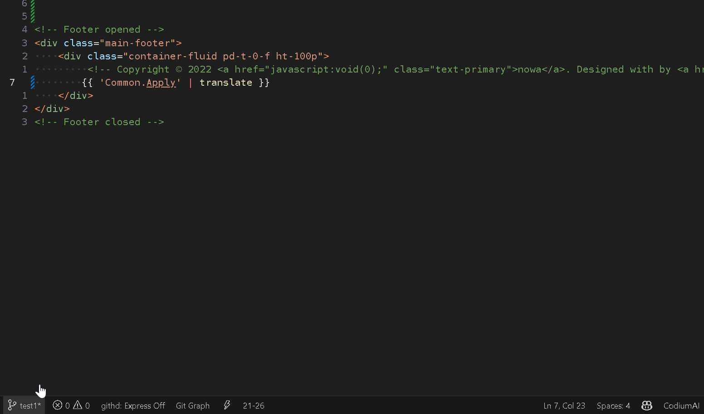
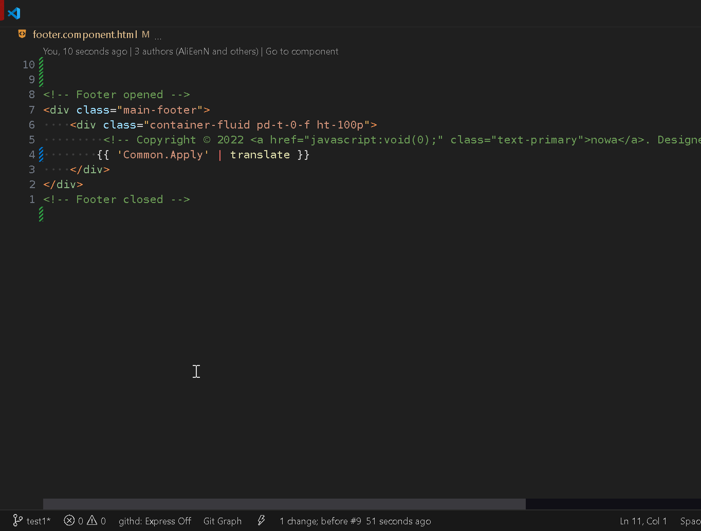
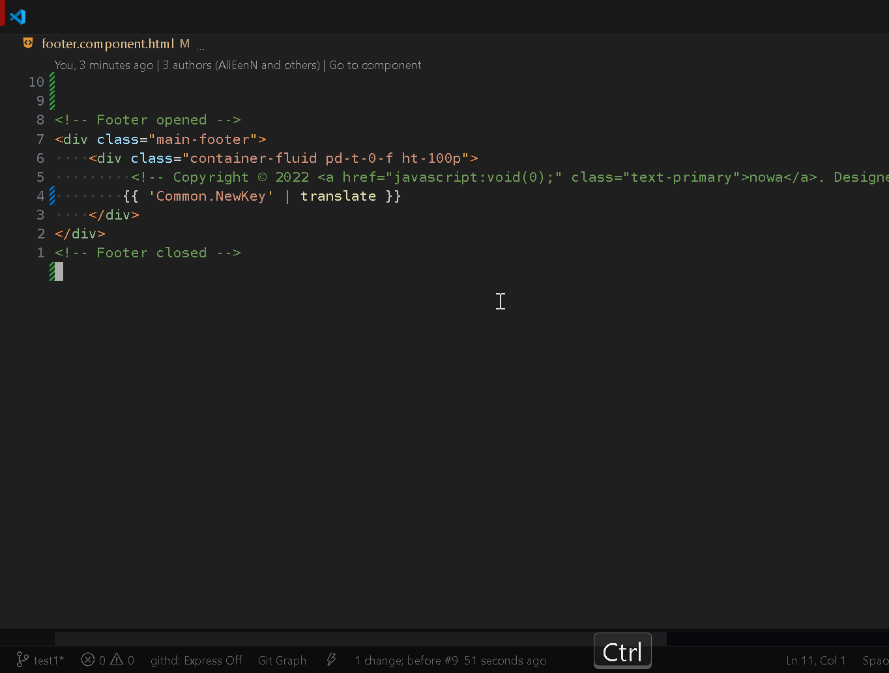
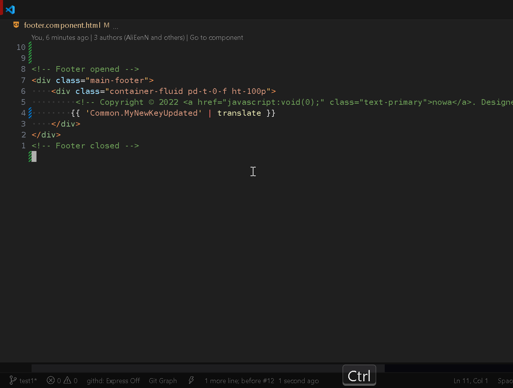

# Json I18n Key

**Json I18n Key** is a Visual Studio Code extension designed to streamline internationalization (i18n) workflows in JSON files. It provides efficient key-path translations, hover tooltips, auto-completion, renaming keys, and AI-powered translation suggestions using GitHub Copilot. The extension helps developers easily manage translation keys across multiple language files.

> This project was inspired by [jsonyamlkeynavigator](https://github.com/shanmuganathan-balaraman/jsonyamlkeynavigator), and some of its code has been adapted to suit the needs of this extension.

## Features

- **Find Translation Key**: Quickly locate and navigate to a translation key in your JSON translation files.
- **Add Translation Key**: Add new translation keys seamlessly across multiple language files (e.g., English, Arabic).
- **Rename Translation Key**: Rename translation keys in all translation files where they exist.
- **Hover to View Translation**: See the translation of a key while hovering over it in the editor.
- **Auto-completion**: Get suggestions for translation keys while typing, making it easier to use and manage your i18n keys.
- **Multi-language Support**: Supports various languages like `en`, `ar`, or any other language files configured.
- **Copilot AI Auto-Translate**: Automatically generate translation suggestions for new keys using GitHub Copilot AI, enhancing the translation workflow.
- **Translation Path Configuration**: Customize your translation file paths and define the default language in your project’s settings.

## How to Use

1. **Configure Translation Files**:
   - Create a `.vscode/settings.json` file in your project and add the following configuration, adjusting the paths as needed:
   ```json
   {
     "json-i18n-key.translationFiles": [
       {
         "lang": "en",
         "filePath": "C:\\Projects\\Project\\src\\assets\\i18n\\en.json",
         "isDefault": true
       },
       {
         "lang": "ar",
         "filePath": "C:\\Projects\\Project\\src\\assets\\i18n\\ar.json",
         "isDefault": false
       }
     ]
   }
   ```
   > This configuration can be set per project or globally in your VSCode settings.

2. **Keybindings**:
   - Use default keybindings or customize them in your VSCode keybindings settings.

## Extension Features in Action

- **Find Translation Key**: Instantly navigate to the key in all translation files and highlight its position.  
  

- **Add Translation Key with Copilot AI Auto-Translate**: Automatically generate translations when adding keys.  
  

- **Rename Translation Key**: Rename keys consistently across all translation files.  
  

- **Hover to View Translation**: See translation details by hovering over keys in the editor.  
  

- **Auto-completion Suggestions**: Get intelligent key suggestions as you type.  
  


## Future TODO

- [x] Cache keys and refresh caching when files change "Optimize Search".
- [ ] Support multiple translation APIs (Google, DeepL, Microsoft).
	- [ ] Allow fallback behavior if the preferred API fails.
- [x] Custom key formats when created or renamed allow options like PascalCase, snake_case, camelCase, kebab-case.
- [ ] Statusbar action copy full translation path.
- [ ] Visual highlights underline missing translations and color-code keys.
- [x] Key validation warn users of duplicate keys when added or updated.
- [ ] Diagnostics check translation files for issues and suggest quick fixes.
- [ ] Option Auto-detect translation files within a project.
- [x] Maintain original JSON formatting (spaces, indentation) to avoid unnecessary git diffs.
- [ ] Sync missing translations ensure consistency across languages.
- [ ] AI-based contextual translation suggestions. It analyzes code context to give more accurate translations.
- [ ] Display inline hover editor for translation keys in code.
- [ ] Search for keys or values that contain a specific string.
- [ ] Auto-merge similar keys to reduce redundancy.
- [ ] Suggest existing keys for reuse when adding new ones.
- [ ] Rename keys and update references in code automatically.
- [ ] Detect and clean up unused translation keys automatically.

## Contributing

Contributions are welcome! If you encounter any issues or have suggestions for improvements, feel free to open an issue or submit a pull request.

## License

This project is licensed under the [MIT License](LICENSE.txt) - see the LICENSE file for details.
